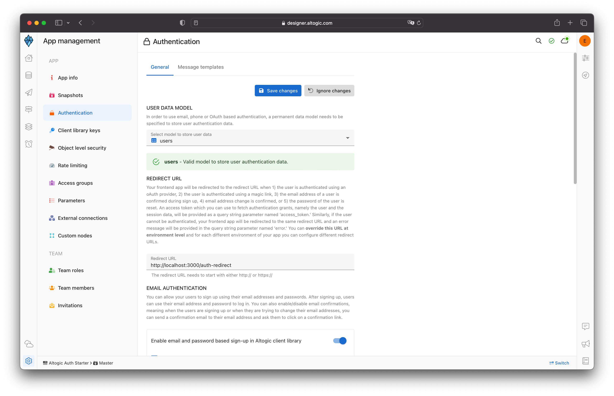

# How to Authenticate Email and Password Using Solid & Altogic

## Introduction
**Altogic** is a Backend as a Service (BaaS) platform and provides a variety of services in modern web and mobile development. Most of the modern applications using React or other libraries/frameworks require to know the identity of a user. And this necessity allows an app to securely save user data and session in the cloud and provide more personalized functionalities and views to users.

Altogic has an Authentication service that integrates and implements well in JAMstack apps. It has a ready-to-use Javascript client library, and it supports many authentication providers such as email/password, phone number, magic link, and OAuth providers like Google, Facebook, Twitter, Github, etc.,

In this tutorial, we will implement email/password authentication with Solid and take a look how as a Solid developer we build applications and integrate with Altogic Authentication.

After completion of this tutorial, you will learn:

* How to create sample screens to display forms like login and signup.
* How to create a home screen and authorize only logged-in users.
* How to create different routes using the **@solidjs/router**.
* How to create an authentication flow by conditionally rendering between these pages whether a user is logged-in or not.
* How to authenticate users using magic link
* How to update user profile info and upload a profile picture
* And we will integrate Altogic authentication with the email/password method.

If you are new to Solid applications, this tutorial is definitely for you to understand the basics and even advanced concepts.

## How email-based sign-up works in Altogic
By default, when you create an app in Altogic, email-based authentication is enabled. In addition, during email-based authentication, the user's email address is also verified. Below you can find the flow of email and password-based sign-up process.


If email verification is disabled, then after step 2, Altogic immediately returns a new session to the user, meaning that steps after step #2 in the above flow are not executed. You can easily configure email-based authentication settings from the App Settings > Authentication in Altogic Designer. You need to specify one critical parameter, the Redirect URL; you can customize this parameter from App Settings > Authentication. Finally, you can customize the email message template from the App Settings > Authentication > Message Templates.

## Prerequisites
To complete this tutorial, ensure you have installed the following tools and utilities on your local development environment.

- [VsCode](https://code.visualstudio.com/download)
- [NodeJS](https://nodejs.org/en/download/)
- [Solid App](https://www.solidjs.com/guides/getting-started)
- You also need an Altogic Account. If you do not have one, you can create an account by [signin up for Altogic](https://designer.altogic.com/).

## Creating an Altogic App
After creating an account, you will see the workspace where you can access your apps.


Click + New app and follow the instructions;

1. In the App name field, enter a name for the app.
2. Enter your subdomain.
3. Choose the deployment location.
4. And select your free execution environment pricing plan.


Then click Next and select Basic template. **This template creates a default user data model for your app which is required by [Altogic Client Library](https://www.npmjs.com/package/altogic) to store user data and manage authentication.** You can add additional user fields to this data model (e.g., name, surname, gender, birthdate) and when calling the `signUpWithEmail` method of the client library you can pass these additional data.


> **Tip:** If you do not select the basic template, instead selected the blank app template the user data model will not be created for your app. In order to use the Altogic Client Library's authentication methods you need a user data model to store the user data. You can easily create a new data model manually and from the **App Settings > Authentication** mark this new data model as your user data model.

Then click Next to confirm and create an app.

Awesome! We have created our application; now click/tap on the **newly created app to launch the Designer.** In order to access the app and use the Altogic client library, we should get `envUrl` and `clientKey` of this app. You can use any one of the API base URLs specified for your app environment as your envUrl.

Click the **Home** icon at the left sidebar to copy the `envUrl` and `clientKey`.


Once the user created successfully, our Solid app will route the user to the Verification page, and a verification email will be sent to the user’s email address. When the user clicks the link in the mail, the user will navigate to the redirect page to grant authentication rights. After successfully creating a session on the Redirect page, users will be redirected to the Home page.

> If you want, you can deactivate or customize the mail verification from **App Settings -> Authentication** in Logic Designer.



## Create a new Solid app
First, we need to create a new Solid app. Open your terminal and run the following command to create a new Solid app.
```bash
npx degit solidjs/templates/js altogic-auth-solidjs
```

### Open the project in VSCode

```
code altogic-auth-solidjs
```

## Integrating with Altogic
Our backend and frontend is now ready and running on the server. ✨

Now, we can install the Altogic client library to our Solid app to connect our frontend with the backend.

```sh
# using npm
npm install altogic
# OR is using yarn
yarn add altogic
```


Let’s create a `libs/` folder inside the `src/` directory to add altogic.js file.

```js
import { createClient } from 'altogic';

const ENV_URL = ''; // replace with your envUrl
const CLIENT_KEY = ''; // replace with your clientKey
const API_KEY = ''; // replace with your apiKey

const altogic = createClient(ENV_URL, CLIENT_KEY, {
	apiKey: API_KEY,
	signInRedirect: '/login',
});

export default altogic;
```
> Replace ENV_URL, CLIENT_KEY and API_KEY which is shown in the **Home** view of [Altogic Designer](https://designer.altogic.com/).

## Install Solid Router
We will use the **@solidjs/router** to create different routes in our app. Let’s install it.

```bash
npm install @solidjs/router
```

Let's create a folder named `pages/` inside the `src/` directory. 

Then create some pages as below:
* Home.jsx
* Login.jsx
* Register.jsx
* LoginWithMagicLink.jsx
* Profile.jsx
* AuthRedirect.jsx

## Replace the Home.jsx file with the following code:
In this page we will show some buttons to navigate to different pages.
```jsx
import { A } from '@solidjs/router';

export default function Home() {
	return (
		<div class="flex items-center justify-center gap-4 h-screen">
			<A href="/login-with-magic-link" class="border px-4 py-2 font-medium text-xl">
				Login With Magic Link
			</A>
			<A href="/login" class="border px-4 py-2 font-medium text-xl">
				Login
			</A>
			<A href="/register" class="border px-4 py-2 font-medium text-xl">
				Register
			</A>
		</div>
	);
}
```

## Replace the Login.jsx file with the following code:

In this page, we will show a form to log in with email and password. We will use Altogic's `altogic.auth.signInWithEmail()` function to log in.

```jsx
import { A, useNavigate } from '@solidjs/router';
import { batch, createSignal, For } from 'solid-js';
import altogic from '../libs/altogic';
import { useAuth } from '../context/AuthContext';

export default function Login() {
	const [email, setEmail] = createSignal('');
	const [password, setPassword] = createSignal('');
	const [errors, setErrors] = createSignal(null);
	const [loading, setLoading] = createSignal(false);
	const navigate = useNavigate();
	const [_, { setUser, setSession }] = useAuth();

	const handleSubmit = async e => {
		e.preventDefault();
		setErrors(null);
		setLoading(true);
		const { session, errors: apiErrors, user } = await altogic.auth.signInWithEmail(email(), password());
		setLoading(false);

		if (apiErrors) {
			return setErrors(apiErrors);
		}

		batch(() => {
			setEmail('');
			setPassword('');
			setUser(user);
			setSession(session);
		});

		navigate('/profile');
	};

	return (
		<section class="flex flex-col items-center justify-center h-96 gap-4">
			<form onSubmit={handleSubmit} class="flex flex-col gap-2 w-full md:w-96">
				<h1 class="self-start text-3xl font-bold">Login to your account</h1>

				{errors() && (
					<div class="bg-red-600 text-white text-[13px] p-2">
						<For each={errors().items}>{error => <p>{error.message}</p>}</For>
					</div>
				)}

				<input
					value={email()}
					onInput={e => setEmail(e.currentTarget.value)}
					type="email"
					placeholder="Type your email"
					required
				/>
				<input
					value={password()}
					onInput={e => setPassword(e.currentTarget.value)}
					type="password"
					placeholder="Type your password"
					required
				/>
				<div class="flex justify-between gap-4">
					<A class="text-indigo-600" href="/register">
						Don't have an account? Register now
					</A>
					<button
						disabled={loading()}
						type="submit"
						class="border py-2 px-3 border-gray-500 hover:bg-gray-500 hover:text-white transition shrink-0"
					>
						Login
					</button>
				</div>
			</form>
		</section>
	);
}
```

## Replace the LoginWithMagicLink.jsx file with the following code:
In this page, we will show a form to log in with Magic Link with only email. We will use Altogic's `altogic.auth.sendMagicLinkEmail()` function to send the magic link to the user's email.

If there is a user matching the entered email address, this function sends a link to that user by mail. and if the link in the e-mail is clicked, the user is logged in.

````jsx
import { A } from '@solidjs/router';
import { batch, createSignal, For } from 'solid-js';
import altogic from '../libs/altogic';

export default function LoginWithMagicLink() {
	const [email, setEmail] = createSignal('');
	const [isDone, setIsDone] = createSignal(false);
	const [loading, setLoading] = createSignal(false);
	const [errors, setErrors] = createSignal(null);

	const submitHandler = async e => {
		e.preventDefault();

		batch(() => {
			setIsDone(false);
			setLoading(true);
			setErrors(null);
		});

		const { errors: apiErrors } = await altogic.auth.sendMagicLinkEmail(email());
		setLoading(false);

		if (apiErrors) {
			return setErrors(apiErrors);
		}

		setIsDone(true);
		setEmail('');
	};

	return (
		<section class="flex flex-col items-center justify-center h-96 gap-4">
			<form onSubmit={submitHandler} class="flex flex-col gap-2 w-full md:w-96">
				<h1 class="self-start text-3xl font-bold">Login with magic link</h1>

				{isDone() && (
					<div class="bg-green-600 text-white text-[13px] p-2">
						We have sent you a magic link. Please check your email.
					</div>
				)}

				{errors() && (
					<div class="bg-red-600 text-white text-[13px] p-2">
						<For each={errors().items}>{error => <p>{error.message}</p>}</For>
					</div>
				)}

				<input
					value={email()}
					onInput={e => setEmail(e.target.value)}
					name="email"
					type="email"
					placeholder="Type your email"
					required
				/>
				<div class="flex justify-between gap-4 items-start">
					<A href="/register" class="text-indigo-600">
						Don't have an account? Register now
					</A>
					<button
						disabled={loading()}
						type="submit"
						class="border py-2 px-3 border-gray-500 hover:bg-gray-500 hover:text-white transition shrink-0"
					>
						Send magic link
					</button>
				</div>
			</form>
		</section>
	);
}
````

## Replace the Register.jsx file with the following code:
In this page, we will show a form to sign up with email and password. We will use Altogic's `altogic.auth.signUpWithEmail()` function to sign up.

```jsx
import { A, useNavigate } from '@solidjs/router';
import { batch, createSignal, For } from 'solid-js';
import altogic from '../libs/altogic';
import { useAuth } from '../context/AuthContext';

export default function Register() {
	const [name, setName] = createSignal('');
	const [email, setEmail] = createSignal('');
	const [password, setPassword] = createSignal('');
	const [errors, setErrors] = createSignal(null);
	const [loading, setLoading] = createSignal(false);
	const [needToVerify, setNeedToVerify] = createSignal(false);
	const { setUser, setSession } = useAuth();

	const navigate = useNavigate();

	const handleSubmit = async e => {
		e.preventDefault();
		setErrors(null);
		setLoading(true);
		const { errors: apiErrors, user, session } = await altogic.auth.signUpWithEmail(email(), password(), name());
		setLoading(false);

		if (apiErrors) {
			return setErrors(apiErrors);
		}

		if (!session) {
			setNeedToVerify(true);
			batch(() => {
				setName('');
				setEmail('');
				setPassword('');
			});
			return;
		}

		setUser(user);
		setSession(session);
		navigate('/profile');
	};

	return (
		<section class="flex flex-col items-center justify-center h-96 gap-4">
			<form onSubmit={handleSubmit} class="flex flex-col gap-2 w-full md:w-96">
				<h1 class="self-start text-3xl font-bold">Create an account</h1>
				{needToVerify() && (
					<div class="bg-green-500 text-white p-2">
						Your account has been created. Please check your email to verify your account.
					</div>
				)}
				{errors() && (
					<div class="bg-red-600 text-white text-[13px] p-2">
						<For each={errors().items}>{error => <p>{error.message}</p>}</For>
					</div>
				)}
				<input
					value={name()}
					onChange={e => setName(e.target.value)}
					autocomplete="given-name"
					type="text"
					placeholder="Type your name"
					required
				/>
				<input
					value={email()}
					onChange={e => setEmail(e.target.value)}
					autocomplete="email"
					type="email"
					placeholder="Type your email"
					required
				/>
				<input
					value={password()}
					onChange={e => setPassword(e.target.value)}
					type="password"
					autocomplete="new-password"
					placeholder="Type your password"
					required
				/>
				<div class="flex justify-between gap-4">
					<A class="text-indigo-600" href="/login">
						Already have an account? Login now
					</A>
					<button
						disabled={loading()}
						type="submit"
						class="border py-2 px-3 border-gray-500 hover:bg-gray-500 hover:text-white transition shrink-0"
					>
						Create account
					</button>
				</div>
			</form>
		</section>
	);
}
```

## Replace the Profile.jsx file with the following code:
In this page, we will show the user's profile.

```jsx
import Avatar from '../components/Avatar';
import UserInfo from '../components/UserInfo';
import Sessions from '../components/Sessions';
import { useAuth } from '../context/AuthContext';
import altogic from '../libs/altogic';
import { useNavigate } from '@solidjs/router';

export default function Profile() {
	const [, { setUser, setSession }] = useAuth();
	const navigate = useNavigate();
	const logout = async () => {
		await altogic.auth.signOut();
		setUser(null);
		setSession(null);
		navigate('/login');
	};

	return (
		<div>
			<section class="h-screen py-4 space-y-4 flex flex-col text-center items-center">
				<Avatar />
				<UserInfo />
				<Sessions />
				<button onClick={logout} class="bg-gray-400 rounded py-2 px-3 text-white">
					Logout
				</button>
			</section>
		</div>
	);
}
```


## Replace the AuthRedirect.jsx file with the following code:
We use this page for verify the user's email address and Login With Magic Link Authentication.

We will use Altogic's `altogic.auth.getAuthGrant()` function to log in with the handled token from the URL.

```jsx
import { A, useLocation, useNavigate, useSearchParams } from '@solidjs/router';
import { createSignal, For, onMount } from 'solid-js';
import altogic from '../libs/altogic';
import { useAuth } from '../context/AuthContext';

export default function AuthRedirect() {
	const { access_token } = useLocation().query;
	const navigate = useNavigate();
	const [errors, setErrors] = createSignal(null);
	const [, { setUser, setSession }] = useAuth();

	onMount(() => {
		altogic.auth.getAuthGrant(access_token).then(({ user, session, errors: apiErrors }) => {
			if (apiErrors) {
				return setErrors(apiErrors);
			}

			setUser(user);
			setSession(session);
			navigate('/profile');
		});
	});

	return (
		<section class="h-screen flex flex-col gap-4 justify-center items-center">
			{errors() ? (
				<div class="text-center">
					<For each={errors().items}>{error => <p class="text-red-500 text-3xl">{error.message}</p>}</For>
				</div>
			) : (
				<div class="text-center">
					<p class="text-6xl">Please wait</p>
					<p class="text-3xl">You're redirecting to your profile...</p>
				</div>
			)}
		</section>
	);
}
```

## Define Routes
Our pages are ready. Now we need to define our routes.

Let's create a folder named `router/` inside the `src/` directory.

Then create a file named `index.jsx` inside the `router/` directory and paste the following code:

```jsx
import { Navigate, Outlet, Route, Routes } from '@solidjs/router';
import { useAuth } from '../context/AuthContext';
import Home from '../pages/Home';
import Login from '../pages/Login';
import Register from '../pages/Register';
import Profile from '../pages/Profile';
import LoginWithMagicLink from '../pages/LoginWithMagicLink';
import AuthRedirect from '../pages/AuthRedirect';

export default function Router() {
	return (
		<Routes>
			<Route path="" component={PublicRoute}>
				<Route path="/" component={Home} />
				<Route path="/login" component={Login} />
				<Route path="/register" component={Register} />
				<Route path="/login-with-magic-link" component={LoginWithMagicLink} />
			</Route>
			<Route path="" component={ProtectedRoute}>
				<Route path="/profile" component={Profile} />
			</Route>
			<Route path="/auth-redirect" component={AuthRedirect} />
		</Routes>
	);
}

function ProtectedRoute() {
	const [{ user, session }] = useAuth();
	if (user && session) {
		return <Outlet />;
	}
	return <Navigate href="/login" />;
}

function PublicRoute() {
	const [{ user, session }] = useAuth();
	if (!user && !session) {
		return <Outlet />;
	}
	return <Navigate href="/profile" />;
}
```

Then we need to update the `App.jsx` file to use the `Router` component.

```jsx
import Router from './router';

export default function App() {
	return (
		<main class="container mx-auto px-4">
			<Router />
		</main>
	);
}
```

## Creating AuthContext
We will use the `AuthContext` to store the user's data and session.

Let's create a folder named `context/` inside the `src/` directory.

Then create a file named `AuthContext.jsx` inside the `context/` directory and paste the following code:

```jsx
import { createContext, useContext } from 'solid-js';
import { createStore } from 'solid-js/store';
import altogic from '../libs/altogic';

const defaultState = {
	user: altogic.auth.getUser(),
	session: altogic.auth.getSession(),
};

const AuthContext = createContext([
	defaultState,
	{
		setUser: () => undefined,
		setSession: () => undefined,
	},
]);

export const AuthProvider = props => {
	const [state, setState] = createStore(defaultState);

	const setUser = user => {
		setState('user', user);
		altogic.auth.setUser(user);
	};
	const setSession = session => {
		setState('session', session);
		altogic.auth.setSession(session);
	};

	return <AuthContext.Provider value={[state, { setUser, setSession }]}>{props.children}</AuthContext.Provider>;
};

export const useAuth = () => useContext(AuthContext);
```

Then we need to update the `index.jsx` file to use the `AuthProvider` component.

```jsx
/* @refresh reload */
import { render } from 'solid-js/web';
import App from './App';
import { Router } from '@solidjs/router';
import './assets/app.css';
import { AuthProvider } from './context/AuthContext';

render(
	() => (
		<Router>
			<AuthProvider>
				<App />
			</AuthProvider>
		</Router>
	),
	document.getElementById('root')
);
```


## Creating components folder
Let's create a folder named `components/` inside the `src/` directory.

Then create these files inside the `components/` directory:
* Avatar.jsx
* Sessions.jsx
* UserInfo.jsx

### Avatar Component for uploading profile picture
Open Avatar.js and paste the below code to create an avatar for the user. For convenience, we will be using the user's name as the name of the uploaded file and upload the profile picture to the root directory of our app storage. If needed you can create different buckets for each user or a generic bucket to store all provided photos of users. The Altogic Client Library has all the methods to manage buckets and files.

```jsx
import altogic from '../libs/altogic';
import { createMemo, createSignal } from 'solid-js';
import { useAuth } from '../context/AuthContext';

export default function Avatar() {
	const [loading, setLoading] = createSignal(false);
	const [errorMessage, setErrorMessage] = createSignal(null);
	const [{ user }, { setUser }] = useAuth();

	const userPicture = createMemo(() => user?.profilePicture ?? `https://ui-avatars.com/api/?name=${user?.name}`);

	async function handleChange(e) {
		const file = e.target.files[0];
		e.target.value = null;
		if (!file) return;
		try {
			setLoading(true);
			setErrorMessage(null);
			const { publicPath } = await updateProfilePicture(file);
			const user = await updateUser({ profilePicture: publicPath });
			setUser(user);
		} catch (e) {
			setErrorMessage(e.message);
		} finally {
			setLoading(false);
		}
	}
	async function updateProfilePicture(file) {
		const { data, errors } = await altogic.storage.bucket('root').upload(user?.name, file);
		if (errors) throw new Error("Couldn't upload file");
		return data;
	}
	async function updateUser(data) {
		const { data: userFromDB, errors } = await altogic.db.model('users').object(user?._id).update(data);
		if (errors) throw new Error("Couldn't update user");
		return userFromDB;
	}
	return (
		<div>
			<figure class="flex flex-col gap-4 items-center justify-center py-2">
				<picture class="border rounded-full w-24 h-24 overflow-hidden">
					
				</picture>
			</figure>
			<div class="flex flex-col gap-4 justify-center items-center">
				<label class="border p-2 cursor-pointer">
					<span>{loading() ? 'Uploading...' : 'Change Avatar'}</span>
					<input
						onChange={handleChange}
						name="picture"
						disabled={loading()}
						class="hidden"
						type="file"
						accept="image/*"
					/>
				</label>
				{errorMessage() && <p class="text-red-500">{errorMessage()}</p>}
			</div>
		</div>
	);
}
```

### UserInfo Component for updating user's name

In this component, we will use Altogic's database operations to update the user's name.

```jsx
import { useAuth } from '../context/AuthContext';
import { createSignal } from 'solid-js';
import altogic from '../libs/altogic';

export default function UserInfo() {
	let input;
	const [{ user }, { setUser }] = useAuth();
	const [changeMode, setChangeMode] = createSignal(false);

	const openChangeMode = () => {
		setChangeMode(true);
		input.focus();
	};

	const saveName = async e => {
		if (e.key !== 'Enter') return;
		const { data, errors } = await altogic.db.model('users').object(user._id).update({ name: e.target.value });
		if (errors) throw errors;
		setUser(data);
		setChangeMode(false);
	};

	return (
		<section class="border p-4 w-full">
			{changeMode() ? (
				<div class="flex items-center justify-center">
					<input
						ref={input}
						value={user.name}
						onKeyPress={saveName}
						type="text"
						name="name"
						class="text-3xl text-center"
					/>
				</div>
			) : (
				<div class="space-y-4">
					<h1 class="text-3xl">Hello, {user?.name}</h1>
					<button onClick={openChangeMode} class="border p-2">
						Change name
					</button>
				</div>
			)}
		</section>
	);
}
```

### Sessions Component for managing sessions

In this component, we will use Altogic's `altogic.auth.getAllSessions()` to get the user's sessions and delete them.

```jsx
import { createSignal, For, onMount } from 'solid-js';
import altogic from '../libs/altogic';
import { useAuth } from '../context/AuthContext';

export default function Sessions() {
	const [sessions, setSessions] = createSignal([]);
	const [{ session }] = useAuth();

	onMount(() => {
		altogic.auth.getAllSessions().then(({ sessions: allSessions, errors }) => {
			if (errors) throw errors;
			setSessions(allSessions.map(s => ({ ...s, isCurrent: s.token === session.token })));
		});
	});

	const logoutSession = async session => {
		const { errors } = await altogic.auth.signOut(session.token);
		if (!errors) setSessions(prev => prev.filter(s => s.token !== session.token));
	};

	return (
		<div class="border p-4 space-y-4">
			<p class="text-3xl">All Sessions</p>
			<ul class="flex flex-col gap-2">
				<For each={sessions()}>
					{session => (
						<li class="flex justify-between gap-12">
							<div>
								{session?.isCurrent ? (
									<span>Current Sessions</span>
								) : (
									<span>
										<strong>Device name: </strong>
										{session?.userAgent?.device?.family}
									</span>
								)}
							</div>
							<div class="flex items-center gap-2">
								<span>{new Date(session.creationDtm).toLocaleDateString('en-US')}</span>
								{!session?.isCurrent && (
									<button
										onClick={() => logoutSession(session)}
										class="border grid place-items-center p-2 h-8 w-8 aspect-square leading-none"
									>
										X
									</button>
								)}
							</div>
						</li>
					)}
				</For>
			</ul>
		</div>
	);
}
```

## Conclusion
Congratulations!✨

You had completed the most critical part of the Authentication flow, which includes private routes, sign-up, sign-in, and sign-out operations.

If you have any questions about Altogic or want to share what you have built, please post a message in our [community forum](https://community.altogic.com/home) or [discord channel](https://discord.gg/zDTnDPBxRz).